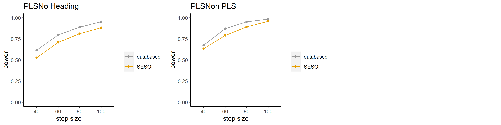

```{r setup, include=FALSE}
knitr::opts_chunk$set(
	echo = TRUE,
	message = FALSE,
	warning = FALSE
)
library(tidyverse)
library(lme4)
library(lmerTest)
library(mixedpower)
library(effectsize)
```

## 說明

採用Kumle et al. (2021)開發的[`mixedpower`](https://github.com/DejanDraschkow/mixedpower)套件，並參考[範例](https://lkumle.github.io/power_notebooks/Scenario1_notebook.html)，使用Kerwer et al.(2020)提供的[源始分析腳本](20200921_Analysis.rmd)建立的混合效果模型，模擬不同樣本可達到的考驗力。


```{r read-data, echo=TRUE, results='show', message=TRUE, warning=TRUE, include=T}


df <- read.csv("Gesamtdatensatz_Total_Dataset_Matrix.csv", na.strings = c("-999"))
#df_codebook <- read.csv("Gesamtdatensatz_Total_Dataset_Codebook.csv")

df_wiss <- read.csv("Wissenstestdatensatz_Knowledge_Test_Dataset_Matrix.csv", na.strings = c("-999"))


```

## H1 Comprehensibility


```{r h01, echo=TRUE, message=FALSE, warning=FALSE}
df$PLS <- factor(df$PLS, levels = c("PLS", "No Heading", "Non PLS"))

df$NH <- factor(df$PLS == "No Heading")
df$OSA <- factor(df$PLS == "Non PLS")

h01m <- lmer(vst ~ (1 | study) + PLS + (1 | id), data = df)

summary(h01m)

## Prepare for simulation
fixed_effects <- c("PLS")
simvar <- "id"

## Simulation parameters
steps <- c(40, 60, 80, 100) # which sample sizes do we want to look at?
critical_value <- 2 # which t/z value do we want to use to test for significance?
n_sim <- 1000 # how many single simulations should be used to estimate power?
```

```{r h01_sim, eval=FALSE, message=FALSE, warning=FALSE, include=FALSE,echo=TRUE}
# set up SESOI model summary
SESOI <- c(6.30467,-0.3,-0.8)

# RUN SIMULATION
power_SESOI_h01m <- mixedpower(model = h01m, data = df,
                        fixed_effects = fixed_effects,
                        simvar = simvar, steps = steps,
                        critical_value = critical_value, n_sim = n_sim,
                        SESOI = SESOI, databased = T)
# PLOT RESULTS
multiplotPower(power_SESOI_h01m, filename = "h01_sim.png")
```

```{r echo=FALSE}

```


## H2 knowledge acquisition


```{r h02, echo=TRUE, message=FALSE, warning=FALSE}
df_wiss$PLS <- factor(df_wiss$PLS, levels = c("PLS", "No Heading", "Non PLS"))


h02m <- glmer(test ~ (1 | study) + PLS + (1 | id), family = binomial("logit"), data = df_wiss)
  

summary(h02m)
```


```{r h02_sim, eval=FALSE, echo=TRUE, message=FALSE, warning=FALSE, include=FALSE}
# set up SESOI by model summary
SESOI <- c(1.45918, -0.2,-0.4)

# RUN SIMULATION
power_SESOI_h02m <- mixedpower(model = h02m, data = df_wiss,
                        fixed_effects = fixed_effects,
                        simvar = simvar, steps = steps,
                        critical_value = critical_value, n_sim = n_sim,
                        SESOI = SESOI, databased = T)
# PLOT RESULTS
multiplotPower(power_SESOI_h02m, filename = "h02_sim.png")
```


```{r echo=FALSE}

```

## Estimated magnitude of easiness effect 

兩項基本假設的描述統計及預估效果量。

```{r basic-summary, echo=TRUE, message=FALSE, warning=FALSE}
## Summarise the averages by participant
df_h01 <- df %>% group_by(id,PLS) %>%
  summarise(p_vst = mean(vst,na.rm=TRUE)) 
df_test <- df_wiss %>% group_by(id, PLS) %>%
  summarise(p_test = mean(test,na.rm=TRUE)) 
## Making of the summary by participants' averages
df_h01 %>% group_by(PLS) %>%
  summarise(M_vst = mean(p_vst,na.rm=TRUE), VAR_vst = var(p_vst,na.rm=TRUE), N_vst = n())
            
df_test %>% group_by(PLS) %>%
  summarise(M_test = mean(p_test,na.rm=TRUE), VAR_test = var(p_test,na.rm=TRUE), N_test = n())


## H1a1: Compare comprehensibility between PLS and non heading PLS
cohens_d(Pair(p_vst[PLS == "PLS"], p_vst[PLS == "No Heading"]) ~ 1, data = df_h01)

## H1a2: Compare comprehensibility between PLS and OSA
cohens_d(Pair(p_vst[PLS == "PLS"], p_vst[PLS == "Non PLS"]) ~ 1, data = df_h01)

## H1b: Compare comprehensibility between non heading PLS and OSA
cohens_d(Pair(p_vst[PLS == "No Heading"], p_vst[PLS == "Non PLS"]) ~ 1, data = df_h01)


## H2a1: Compare knowledge acquisition between PLS and non heading PLS
cohens_d(Pair(p_test[PLS == "PLS"], p_test[PLS == "No Heading"]) ~ 1, data = df_test)

## H2a2: Compare knowledge acquisition between PLS and OSA
cohens_d(Pair(p_test[PLS == "PLS"], p_test[PLS == "Non PLS"]) ~ 1, data = df_test)

## H2b: Compare knowledge acquisition between non heading PLS and OSA
cohens_d(Pair(p_test[PLS == "No Heading"], p_test[PLS == "Non PLS"]) ~ 1, data = df_test)
```


簡易效應三項假設的描述統計及預估效果量。

```{r easiness-summary, echo=TRUE, message=FALSE, warning=FALSE}
## Summarise the averages by participant
df_subj <- df %>% group_by(id,PLS) %>%
  summarise(p_vtr = mean(vtr,na.rm=TRUE),p_wahr = mean(wahr,na.rm=TRUE),p_ent=mean(ent,na.rm=TRUE)) 
## Making of the summary by participants' averages
df_subj %>% group_by(PLS) %>%
  summarise(M_vtr = mean(p_vtr,na.rm=TRUE), VAR_vtr = var(p_vtr,na.rm=TRUE),N_vtr = n(),
            M_wahr = mean(p_wahr,na.rm=TRUE), VAR_wahr = var(p_wahr,na.rm=TRUE), N_wahr = n(),
            M_ent = mean(p_ent,na.rm=TRUE), VAR_ent = var(p_ent,na.rm=TRUE), N_ent = n())


## H3a: Compare credibility between PLS and OSA
cohens_d(Pair(p_vtr[PLS == "PLS"], p_vtr[PLS == "Non PLS"]) ~ 1, data = df_subj)

## H3b: Compare credibility between non heading PLS and OSA
cohens_d(Pair(p_vtr[PLS == "No Heading"], p_vtr[PLS == "Non PLS"]) ~ 1, data = df_subj)


## H4a: Compare confidence between PLS and OSA
cohens_d(Pair(p_wahr[PLS == "PLS"], p_wahr[PLS == "Non PLS"]) ~ 1, data = df_subj)

## H4b: Compare confidence between non heading PLS and OSA
cohens_d(Pair(p_wahr[PLS == "No Heading"], p_wahr[PLS == "Non PLS"]) ~ 1, data = df_subj)


## H5a: Compare ability to make a decision between PLS and OSA
cohens_d(Pair(p_ent[PLS == "PLS"], p_ent[PLS == "Non PLS"]) ~ 1, data = df_subj)

## H5b: Compare ability to make a decision between non heading PLS and OSA
cohens_d(Pair(p_ent[PLS == "No Heading"], p_ent[PLS == "Non PLS"]) ~ 1, data = df_subj)
```

> 建議執行effectsize::interpret_cohens_d(d)，了解各項假設的預估效果量大小。

```{r power-plot}
# Plot sample size curves for detecting estimated effects of
# various sizes.

library(pwr)

# range of effect size
d <- seq(.16,.35,.01)
nd <- length(d)

# power values
p <- seq(.4,.9,.1)
np <- length(p)

# obtain sample sizes
samsize <- array(numeric(nd*np), dim=c(nd,np))
for (i in 1:np){
  for (j in 1:nd){
    result <- pwr.t.test(n = NULL, d = d[j], 
    sig.level = .05, power = p[i],
    type="paired",
    alternative = "two.sided")
    samsize[j,i] <- ceiling(result$n)
  }
}

# set up graph
xrange <- range(d)
yrange <- round(range(samsize))
colors <- rainbow(length(p))
plot(xrange, yrange, type="n",
  xlab="Cohen's d (d)",
  ylab="Sample Size (n)" )

# add power curves
for (i in 1:np){
  lines(d, samsize[,i], type="l", lwd=2, col=colors[i])
}

# add annotation (grid lines, title, legend)
abline(v=0, h=seq(0,yrange[2],50), lty=2, col="grey89")
abline(h=0, v=seq(xrange[1],xrange[2],.02), lty=2,
   col="grey89")
title("Sample Size Estimation for Easieness Effects\n
  Sig=0.05 (Two-tailed)")
legend("topright", title="Power", as.character(p),
   fill=colors)
```


## H3 Credibility


```{r h03, echo=TRUE, message=FALSE, warning=FALSE}

h03m <- lmer(vtr ~ (1 | study) +PLS + (1 | id), data = df)

summary(h03m)
```


```{r h03_sim, eval=FALSE, message=FALSE, warning=FALSE, include=FALSE,echo=TRUE}
# set up SESOI by model summary
SESOI <- c(5.36548, -0.12,-0.12)

# RUN SIMULATION
power_SESOI_h03m <- mixedpower(model = h03m, data = df,
                        fixed_effects = fixed_effects,
                        simvar = simvar, steps = steps,
                        critical_value = critical_value, n_sim = n_sim,
                        SESOI = SESOI, databased = T)
# PLOT RESULTS
multiplotPower(power_SESOI_h03m, filename = "h03_sim.png")
```


```{r echo=FALSE}
knitr::include_graphics("h03_sim.png")
```


## H4 Ability to Evaluate


```{r h04, echo=TRUE, message=FALSE, warning=FALSE}

h04m <- lmer(wahr ~ (1 | study) +PLS + (1 | id), data = df)

summary(h04m)
```


```{r h04_sim, eval=FALSE, message=FALSE, warning=FALSE, include=FALSE,echo=TRUE}
# set up SESOI by model summary
SESOI <- c(3.72630, -0.2,-0.23)

# RUN SIMULATION
power_SESOI_h04m <- mixedpower(model = h04m, data = df,
                        fixed_effects = fixed_effects,
                        simvar = simvar, steps = steps,
                        critical_value = critical_value, n_sim = n_sim,
                        SESOI = SESOI, databased = T)
# PLOT RESULTS
multiplotPower(power_SESOI_h04m, filename = "h04_sim.png")
```


```{r echo=FALSE}
knitr::include_graphics("h04_sim.png")
```


## H5 Ability to Make a Decision


```{r h05, echo=TRUE, message=FALSE, warning=FALSE}

h05m <- lmer(ent ~ (1 | study) +PLS + (1 | id), data = df)

summary(h05m)
```


```{r h05_sim, eval=FALSE, message=FALSE, warning=FALSE, include=FALSE,echo=TRUE}
# set up SESOI by model summary
SESOI <- c(3.11747, -0.3,-0.33)

# RUN SIMULATION
power_SESOI_h05m <- mixedpower(model = h05m, data = df,
                        fixed_effects = fixed_effects,
                        simvar = simvar, steps = steps,
                        critical_value = critical_value, n_sim = n_sim,
                        SESOI = SESOI, databased = T)
# PLOT RESULTS
multiplotPower(power_SESOI_h05m, filename = "h05_sim.png")
```


```{r echo=FALSE}

```


### 參考文獻

Kumle, L., Võ, M. L.-H., & Draschkow, D. (2021). Estimating power in (generalized) linear mixed models: An open introduction and tutorial in R. Behavior Research Methods. https://doi.org/10.3758/s13428-021-01546-0
