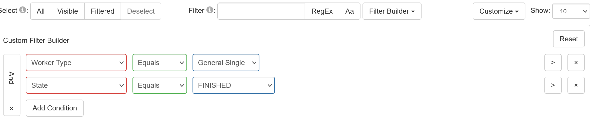

```{r setup, include=FALSE}
knitr::opts_chunk$set(
	echo = TRUE,
	message = FALSE,
	warning = FALSE
)

library(tidyverse)
```

## Export data from JATOS server

1. 登入部署實驗的JATOS伺服器，進入“Replication: Kerwer et al.(2021)正式版”資訊網頁，點選`Study Results`進入實驗資料管理網頁。

2. 篩選要匯出的實驗資料：點選"Filter Builder" 進行下圖設定



3. 選擇要匯出的實驗資料：確認顯示的資料符合篩選條件，點選上圖左上方"Filtered"按鈕，選取所有要匯出的資料。

4. 匯出meta與結果資料：分別按"Export Metadata"及”Export Results"顯示選單，選擇“Selected"。依系統提示，下載檔案至存放這份Rmd檔的資料夾。

- meta檔是csv格式；結果檔是txt格式


## Import results data


1. 開啟OpenSesame本機版，切換至OSWeb視窗。確認”Include JATOS context information"已經打勾。

2. 點選`Convert JATOS results to csv/xlsx`，開啟檔案管理選單。

3. 選擇開啟剛匯出的txt檔，另存新檔為同檔名的csv格式檔案。


## Build the sheet of identifier codes

執行以下程式碼，建立實驗完成碼清單。

```{r import-results}
## List the results files

results_files <- list.files(pattern = "^jatos_results_")

## Import the data file into data frame
df <- read_csv(results_files[1])

## Take the identifiers
finished_id <- unique(df$identifier)
knitr::kable(finished_id)

## Save identifier codes to a file
write.csv(finished_id, file="PL_id.txt")
```

