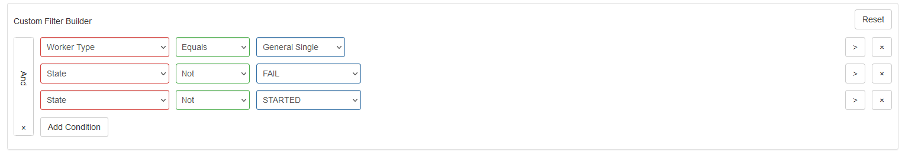

```{r setup, include=FALSE}
knitr::opts_chunk$set(
	echo = TRUE,
	message = FALSE,
	warning = FALSE
)

library(tidyverse)
library(lubridate)
```

## Export data from JATOS server

1. 登入部署實驗的JATOS伺服器，進入“Replication: Kerwer et al.(2021)正式版”資訊網頁，點選`Study Results`進入實驗資料管理網頁。

2. 篩選要匯出的實驗資料：點選"Filter Builder" 進行下圖設定

* 20220317更新：根據外校老師回報，部分同學有完成實驗，但是因為沒有關閉視窗，導致後台狀態註記為“DATA_RETRIEVED”，更新篩選設定有增加有效資料。



3. 選擇要匯出的實驗資料：確認顯示的資料符合篩選條件，點選上圖左上方"Filtered"按鈕，選取所有要匯出的資料。

4. 匯出meta與結果資料：分別按"Export Metadata"及”Export Results"顯示選單，選擇“Selected"。依系統提示，下載檔案至存放這份Rmd檔的資料夾。

- meta檔是csv格式；結果檔是txt格式


## Import results data

1. 開啟OpenSesame本機版，切換至OSWeb視窗。確認”Include JATOS context information"已經打勾。

2. 點選`Convert JATOS results to csv/xlsx`，開啟檔案管理選單。

3. 選擇開啟剛匯出的txt檔，另存新檔為同檔名的csv格式檔案。

- 最後結果jason檔及csv檔總量超過100 Mega bytes，壓縮為zip才能推送至github。

## Build the sheet of identifier codes

執行以下程式碼，建立實驗完成碼清單。

```{r import-results}
## List the results files
## Jatos file name format: "jatos_results_"
results_files <- list.files(pattern = "^jatos_results_")


## Import the data file into data frame
df <- read_csv(results_files[1])

## Take the identifiers
finished_id <- unique(df$identifier)
#Id <- as_tibble(finished_id)
#Id2 <- mutate(Id,id = rep(1:nrow(Id)))
#knitr::kable(Id2)

## Filter the results for the meta summary
df_finished <- df %>%
  filter(identifier %in% finished_id)

## Save identifier codes to a file
write.csv(finished_id, file="PL_id.txt")
```


At the end, `r length(finished_id)` participants got the identifiers. Legal identifiers are saved in "PL_id.txt".


## Summarize study meta

```{r meta-summary}
## Load meta file
meta_file <- list.files(pattern = "^jatos_meta_")


## filter the available meta info by results file
df_meta <- read_csv(meta_file) %>%
  filter(`Result ID` %in% unique(df_finished$jatosStudyResultId)) ## 150 participants had a legal finish

## Convert duration to minutes
minutes_count <- ((df_meta$Duration %>% hms() %>% hour()*60)+
(df_meta$Duration %>% hms() %>% minute())) 

## Summary of study duration by minutes 
minutes_count %>% summary()

## draw a box plot
minutes_count%>%
  log10() %>% ## convert minutes to log10
  boxplot(ylab="log10(minutes)")

## merge valid meta and results
df_all_variables <- right_join(df_finished, df_meta, by=c("jatosStudyResultId" = "Result ID"))


df_all_variables %>% write_csv(file = "rawdata.csv")

## Summary how many items the legal participants had responded
df_all_variables %>% group_by(jatosStudyResultId) %>%
  summarise(trial_N = n()) %>%
  summary()
```

