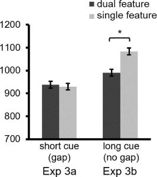

```{r setup, include=FALSE}
knitr::opts_chunk$set(
	echo = TRUE,
	message = FALSE,
	warning = FALSE
)
library(tidyverse)
library(afex)
rawdata <- read_csv(file="EXP3.csv")
```


## Design and variables description

```{r preview, echo=FALSE}
knitr::kable(data.frame(
             Variables = names(rawdata), 
             Descriptions =c(
               "no_gap = long cue; gap = short cue", ## update coding in the data set
               "MTurk ID",
               "conj = dual feature; sing = single feature",
               "matching of cue and target. m = match ; mm = mismatch",
               "Trial number by Trial type and Match",
               "Correctness of trial: 1 = correct; 0 = incorrect",
               "Response time of trial(sec)"
             ) ) )
```

We found the original data set had inconsistent codes on "Task".

## By participant summary

```{r summary_data_3}
## Summary of participants' accuracy
sumdata3 = rawdata %>% 
  mutate(across("task", recode, "gap" = 'short_cue', "no_gap" = 'long_cue' )) %>%
  mutate(across("conjunction_single", recode, "conj" = 'dual')) %>%
  group_by(task, PPnr, conjunction_single, match_mismatch) %>%
  summarise(acc = mean(accuracy,na.rm=TRUE)) %>%
  group_by(task, PPnr, conjunction_single) %>%
  summarise(Acc = mean(acc)) %>%
right_join(
## Summary of participants' RT
rawdata %>%  
  mutate(across("task", recode, "gap" = 'short_cue', "no_gap" = 'long_cue' )) %>%
  mutate(across("conjunction_single", recode, "conj" = 'dual')) %>%
  filter(reaction_time > 0.1 & reaction_time < 3.000 & accuracy==1) %>%
  group_by(task, PPnr, conjunction_single, match_mismatch) %>%
  summarise(mRT = mean(reaction_time*1000)) %>%
  group_by(task, PPnr, conjunction_single) %>%
  summarise(RT = mean(mRT)),
by=c("task","PPnr", "conjunction_single"))

## Summary stat
sumdata3 %>% group_by(task, conjunction_single) %>%
  summarise(N = n(), m_RT = mean(RT), sd_RT = sd(RT), m_ACC = mean(Acc), sd_ACC = sd(Acc)) %>% knitr::kable(caption = "Exp3 result summary: three factors")

## Export summarized data 
write_csv(sumdata3, file="EXP3_long.csv") ## long table

sumdata3 %>% pivot_wider(names_from = conjunction_single, values_from = c(RT,Acc)) %>% write_csv(file="EXP3_wide.csv") ## wide table

strange_pp <- sumdata3 %>% group_by(PPnr) %>%
  summarise(N = n()) %>%
  filter(N != 4) %>%
  pull(PPnr)
```


Through 3-factor summary table, we learned the "trial type" are collapsed in the final analysis. One noticeable point was that one~two participants in long cue (no gap) task failed to make correct response on match/mismatch stimuli.

```{r summary_data_2}
## Summary of participants' accuracy
sumdata2 = rawdata %>% 
  mutate(across("Task", recode, 'long cue' = "gap", 'short cue' = "no gap")) %>%
  group_by(Task, PPnr, `Trial Type`) %>%
  summarise(acc = mean(accuracy) ) %>%
right_join(
## Summary of participants' RT
rawdata %>%  
  mutate(across("Task", recode, 'long cue' = "gap", 'short cue' = "no gap")) %>%
  filter(reaction_time > 0.1 & reaction_time < 3.000) %>%
  group_by(Task, PPnr, `Trial Type`) %>%
  summarise(RT = mean(reaction_time*1000)),
by=c("Task","PPnr", "Trial Type")) %>%
  right_join(
## Summary of participants' RT
rawdata %>%  
  filter(`Target Type` == "Match") %>% 
  mutate(across("Task", recode, 'long cue' = "gap", 'short cue' = "no gap")) %>%
  filter(reaction_time > 0.1 & reaction_time < 3.000) %>%
  group_by(Task, PPnr, `Trial Type`) %>%
  summarise(match_RT = mean(reaction_time*1000)), ## compute the responses for the matching targets only.
by=c("Task","PPnr", "Trial Type")    
  )

## Summary stat
summary_exp3 <- sumdata2 %>% group_by(Task, `Trial Type`) %>%
  summarise(N = n(), m_RT = mean(RT), SD_RT = sd(RT), se_RT = (mean_se(RT)[,3] - mean_se(RT)[,2] ), m_ACC = mean(acc), SD_ACC = sd(acc), alt_m_RT = mean(match_RT), alt_SD_RT = sd(match_RT), alt_se_RT = (mean_se(match_RT)[,3] - mean_se(match_RT)[,2] )) 

knitr::kable(summary_exp3)
```

The summary stat as like the original report showed some tiny difference, but the results are nearly equal.

- Ploting the summary stat

```{r plot_summary}
## Plot summary stat
ggplot(summary_exp3, aes(x =Task, y=m_RT, fill=`Trial Type`)) +
  geom_bar(stat = "identity", position = position_dodge()) + 
  geom_errorbar(aes(ymin=m_RT - se_RT,ymax=m_RT + se_RT), width = .2,
                position = position_dodge(.9))+ 
 coord_cartesian(ylim=c(700,1200))+ 
  scale_fill_manual(values=c('black','lightgray'))+
    theme_classic()
```


```{r original_exp3, echo=FALSE, fig.cap="Original Figure 12: RTs for each of the condition s in EXP 3 a-b."}

```


```{r plot_match_summary}
## Plot summary stat of matching RT
ggplot(summary_exp3, aes(x =Task, y=alt_m_RT, fill=`Trial Type`)) +
  geom_bar(stat = "identity", position = position_dodge()) + 
  geom_errorbar(aes(ymin=alt_m_RT - alt_se_RT,ymax=alt_m_RT + alt_se_RT), width = .2,
                position = position_dodge(.9))+ 
 coord_cartesian(ylim=c(700,1200))+ 
  scale_fill_manual(values=c('black','lightgray'))+
    theme_classic()
```


- Reproduce the ANOVA on correct RT and accuracy

```{r exp3_anova}
exp3.rt.aov <- aov_car(RT ~ `Trial Type`*Task + Error(PPnr/`Trial Type`), data=sumdata2, anova_table = list(correction="none", es="pes"))
knitr::kable(nice(exp3.rt.aov))

exp3.acc.aov <- aov_car(acc ~ `Trial Type`*Task + Error(PPnr/`Trial Type`), data=sumdata2, anova_table = list(correction="none", es="pes"))
knitr::kable(nice(exp3.acc.aov))

```

- ANOVA on match responses


```{r exp3_match_anova}
exp3.alt.rt.aov <- aov_car(match_RT ~ `Trial Type`*Task + Error(PPnr/`Trial Type`), data=sumdata2, anova_table = list(correction="none", es="pes"))
knitr::kable(nice(exp3.alt.rt.aov))

```


- Comparison stat: dual features vs. single feature

*combine match and mismatch targets*

```{r exp3_comparison}
results = cbind(
Task = c("long cue","short cue"),
rbind(
t.test(RT ~ `Trial Type`, paired=TRUE, data = subset(sumdata2, Task == "no gap" & PPnr != strange_pp)) %>% broom::tidy() %>% mutate(d = abs(statistic/sqrt(parameter+1))),
t.test(RT ~ `Trial Type`, paired=TRUE, data = subset(sumdata2, Task == "gap")) %>% broom::tidy() %>% mutate(d = abs(statistic/sqrt(parameter+1))))
)

knitr::kable(results)
```

*only match targets*

```{r exp3_alt_comparison}
alt_results = cbind(
Task = c("long cue","short cue"),
rbind(
t.test(match_RT ~ `Trial Type`, paired=TRUE, data = subset(sumdata2, Task == "no gap" & PPnr != strange_pp)) %>% broom::tidy() %>% mutate(d = abs(statistic/sqrt(parameter+1))),
t.test(match_RT ~ `Trial Type`, paired=TRUE, data = subset(sumdata2, Task == "gap")) %>% broom::tidy() %>% mutate(d = abs(statistic/sqrt(parameter+1))))
)

knitr::kable(alt_results)
```

## Required sample size for replication study

```{r sample_size1}
power80_n1 <- pwr::pwr.t.test(d=.424,
           power=.8,
           sig.level = .05,
           alternative = "two.sided",
           type="paired") %>%
  pluck("n")
power95_n1 <- pwr::pwr.t.test(d=.424,
           power=.95,
           sig.level = .05,
           alternative = "two.sided",
           type="paired") %>%
  pluck("n")

```

Given the *d* = 0.424, we have the sample size estimations as below: 
If we will replicate this study in terms of the identical design, based on power = .80, the smallest sample size for a task is `r power80_n1`. To achieve the highest reproducibility, namly power = .95, the required sample size for a task is `r power95_n1`.


```{r sample_size2}
power80_n2 <- pwr::pwr.t.test(d=.281,
           power=.8,
           sig.level = .05,
           alternative = "two.sided",
           type="paired") %>%
  pluck("n")
power95_n2 <- pwr::pwr.t.test(d=.281,
           power=.95,
           sig.level = .05,
           alternative = "two.sided",
           type="paired") %>%
  pluck("n")

```

Given the *d* = 0.281, we have the sample size estimations as below: 
If we will replicate this study in terms of the identical design, based on power = .80, the smallest sample size for a task is `r power80_n2`. To achieve the highest reproducibility, namly power = .95, the required sample size for a task is `r power95_n2`.

