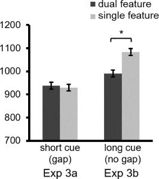

```{r setup, include=FALSE}
knitr::opts_chunk$set(
	echo = TRUE,
	message = FALSE,
	warning = FALSE
)
library(tidyverse)
rawdata <- read_csv(file="EXP3.csv")
```


## Design and variables description

```{r preview, echo=FALSE}
knitr::kable(data.frame(
             Variables = names(rawdata), 
             Descriptions =c(
               "no_gap = long cue; gap = short cue",
               "MTurk ID",
               "conj = dual feature; sing = single feature",
               "matching of cue and target. m = match ; mm = mismatch",
               "Trial number by Trial type and Match",
               "Correctness of trial: 1 = correct; 0 = incorrect",
               "Response time of trial(sec)"
             ) ) )
```


## By participant summary

```{r summary_data}
## Summary of participants' accuracy
sumdata = rawdata %>% group_by(Task, PPnr, `Trial Type`, `Target Type`) %>%
  summarise(acc = mean(accuracy)) %>%
right_join(
## Summary of participants' RT
rawdata %>%  filter(reaction_time > 0.1 & reaction_time < 3.000) %>%
  group_by(Task, PPnr, `Trial Type`, `Target Type`) %>%
  summarise(RT = mean(reaction_time*1000)),
by=c("Task","PPnr", "Trial Type", "Target Type"))

## Summary stat
sumdata %>% group_by(Task, `Trial Type`, `Target Type`) %>%
  summarise(N = n(), m_RT = mean(RT), sd_RT = sd(RT), m_ACC = mean(acc), sd_ACC = sd(acc)) %>% knitr::kable(caption = "Exp3 result summary")
```

```{r original_exp3, echo=FALSE, fig.cap="Original Figure 12: RTs for each of the condition s in EXP 3 a-b."}

```

